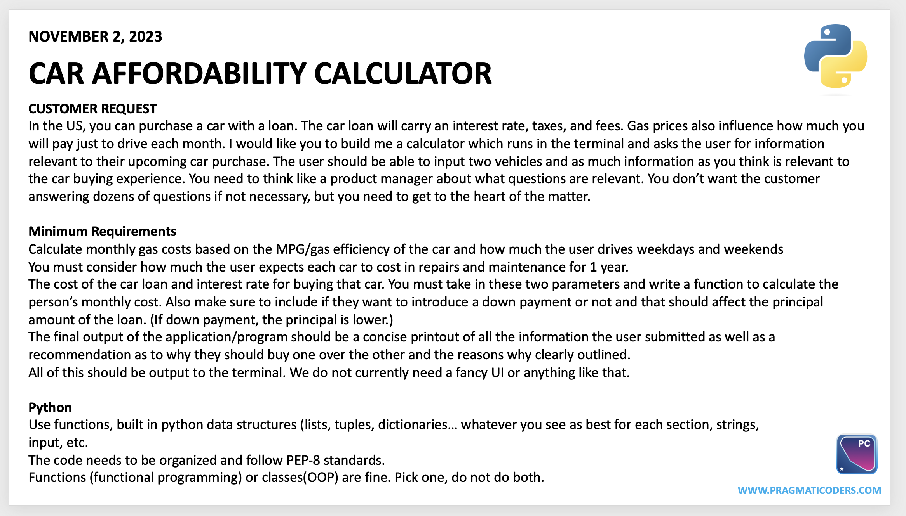

# Pragmaticoders DE Course
## Pre Work
# Project 1 - Car Loan Calculator

Project requirements:

## Project assignment from pragmatiCoders :)
**Customer Request**  
In the US, you can purchase a car with a loan. The car loan will carry an interest rate, taxes, and fees. Gas prices also influence how much you will pay just to drive each month. I would like you to build me a calculator which runs in the terminal and asks the user for information relevant to their upcoming car puchase. The user should be able to input two vehicles and as much information you think is relevant to the car buying experience. You need to think like a product manager about what questions are relevant. You don't want the customer answering dozens of questions if no necessary, but you need to get to the heart of the matter. 

**Minimum Requirements**  
Calculate monthly gas costs based on the MPG/gas efficiency of the car and how much the user drives weekdays and weekend. 
You must consider how much the user expects each car to cost in repairs and maintenance for 1 year. 
The cost of the car loan and interest rate for buying that car. You must take in these two parameters and write a function to calculate the person's monthly cost. Also make sure to include if they want to introduce a down payment or not and that should affect the principal amount of the loan. (If down payment, the principal is lower.)  
The final output of the application/program should be a concise printout of all the information the user submitted as well as a recommendation as to why they should buy one over the other and reasons why clearly outlined. 
All of this should be output to the terminal.  

Code follows PEP-8 standards. 
---
Tomislav Dukez
Decemeber 2023
